# Other cool trackers

## NPR: Tracking The Spread Of The Coronavirus In The U.S.

https://www.npr.org/sections/health-shots/2020/03/16/816707182/map-tracking-the-spread-of-the-coronavirus-in-the-u-s

### Table: Heatmap block new cases

### Map: Centroid bubble and selective labels

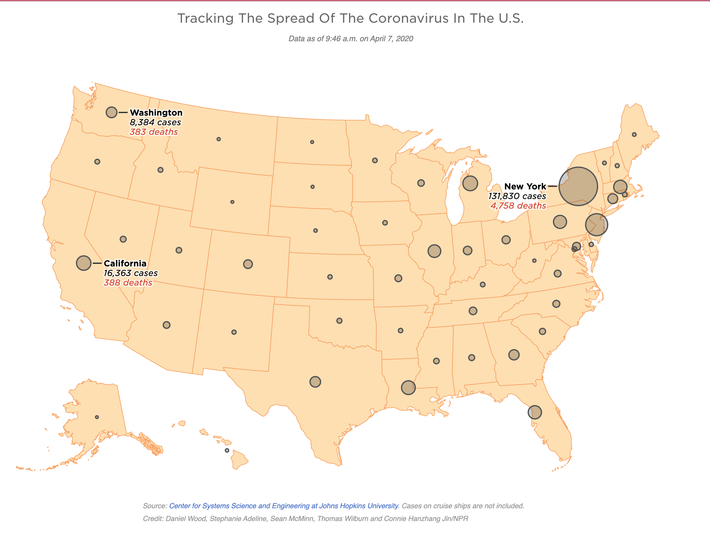

## NYTimes

https://www.nytimes.com/interactive/2020/us/coronavirus-us-cases.html

### Above the fold: spark chart

### Map: Total cases

### Cases table 

### Map: Cases by capita map

### Map: Cases doubling

## FT: Coronavirus tracked: the latest figures as the pandemic spreads 

https://www.ft.com/coronavirus-latest

### Chart: Worldwide daily death toll, log scale

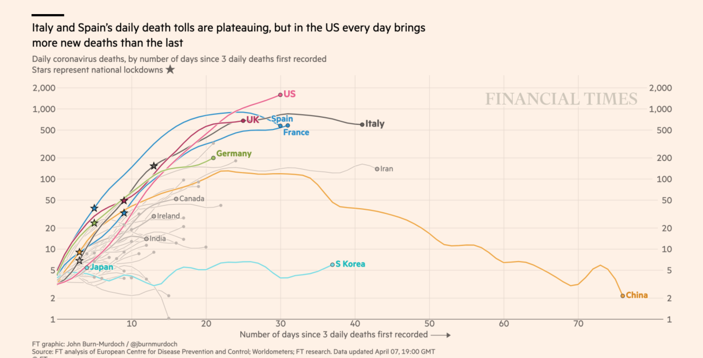

### Small multiples: Worldwide daily death tolls, logscale

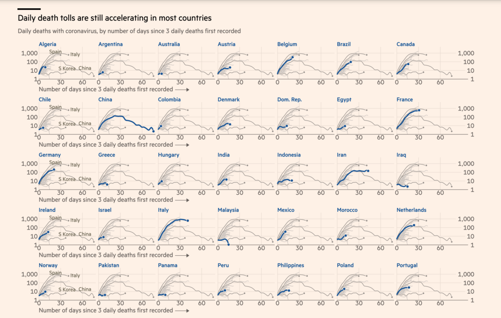

-------------

## WaPo

https://www.washingtonpost.com/graphics/2020/national/coronavirus-us-cases-deaths/

### Above fold

### Table+small multiples: Deaths/cases by raw numbers and per 100k

### Small multiples: World daily new cases 

https://www.washingtonpost.com/graphics/2020/world/mapping-spread-new-coronavirus/

## CNN: Tracking Covid-19 cases in the US

https://www.cnn.com/interactive/2020/health/coronavirus-us-maps-and-cases/

### Table: Reported cases and deaths

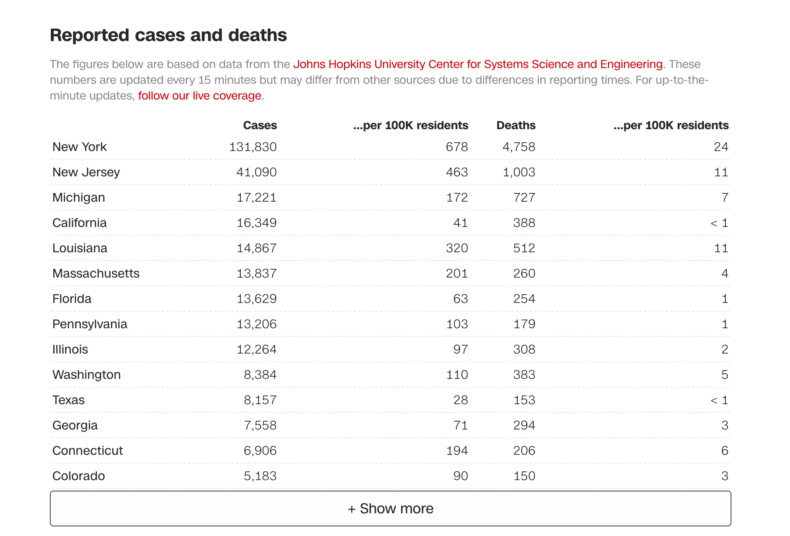

### Line chart: Doubling rate by state

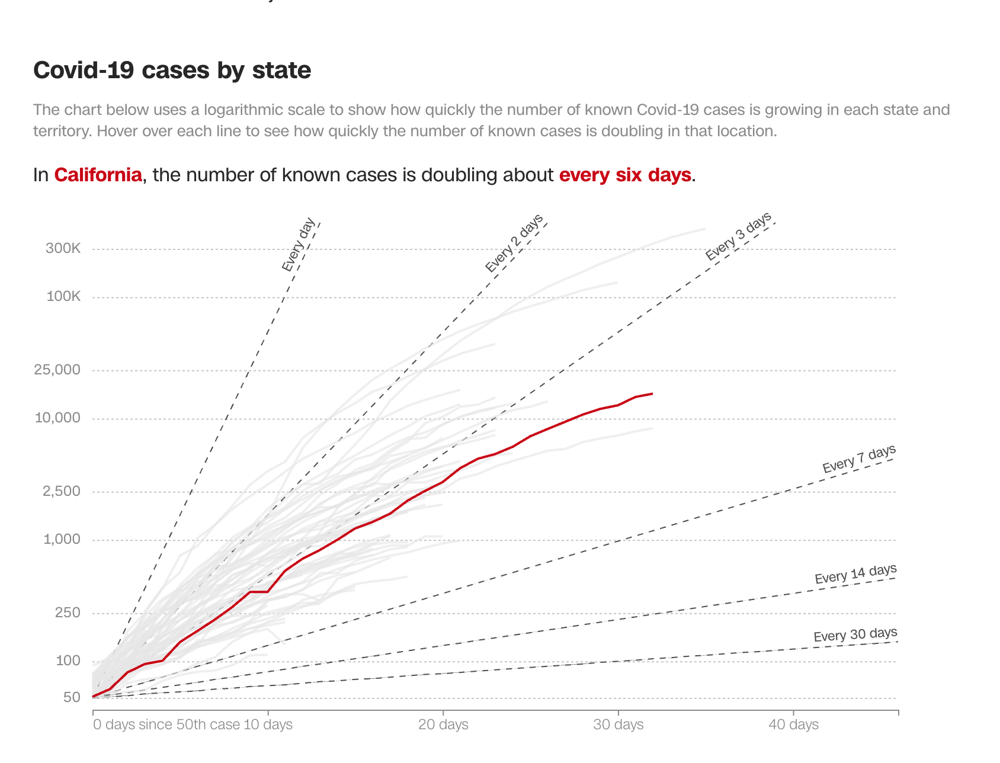

## Bloomberg: Mapping the Coronavirus Outbreak Across the World

### Above the fold small multiples

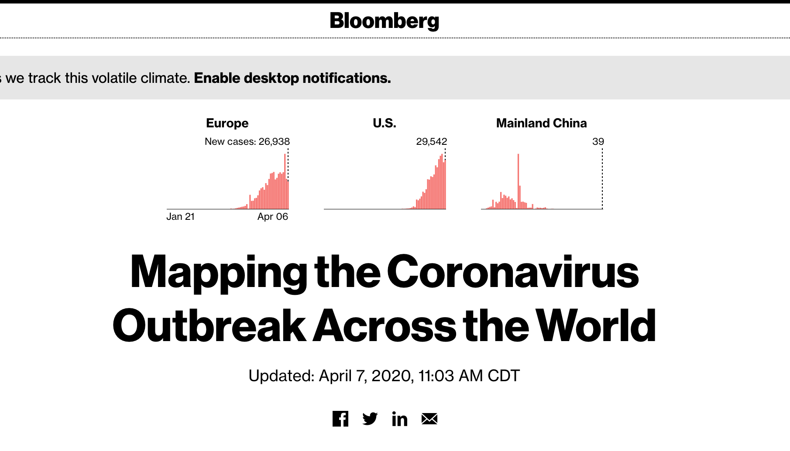

### Dashboard: World cases and deaths count

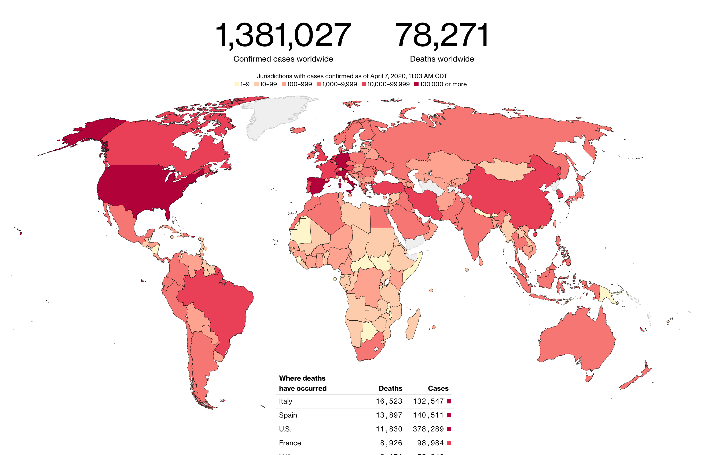

### Small multiples: Global Cases Added Per Day

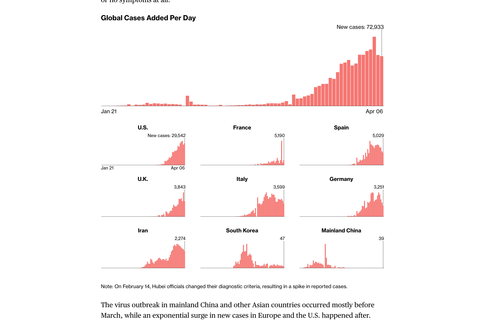

### Chart: Seven-day rolling average of new deaths and cases

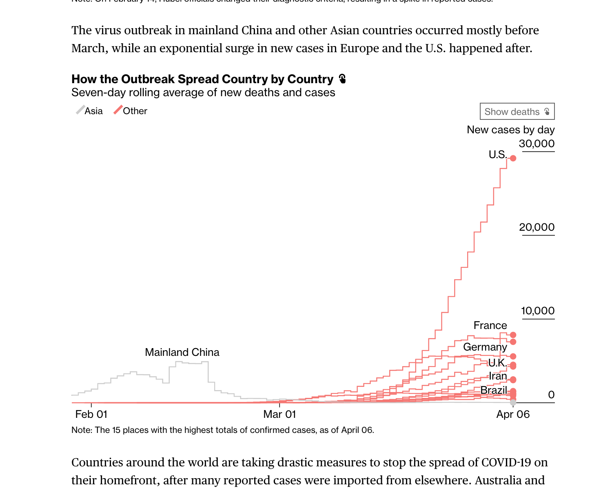

----

### LA Times: Tracking coronavirus in California

https://www.latimes.com/projects/california-coronavirus-cases-tracking-outbreak/

### Above the fold

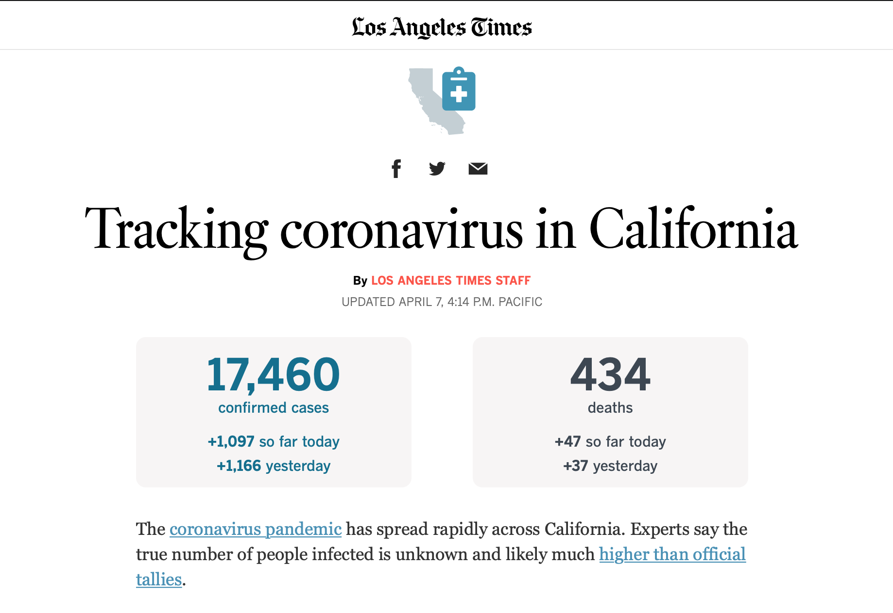

### Chart: Cases/Deaths by Day, California, with rolling average

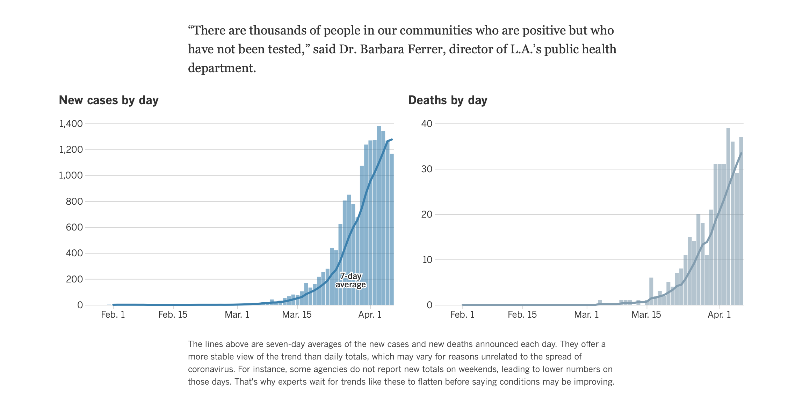

### Table: Heatmap by county, 3-day-average new cases

### Table: County-by-county restrictions

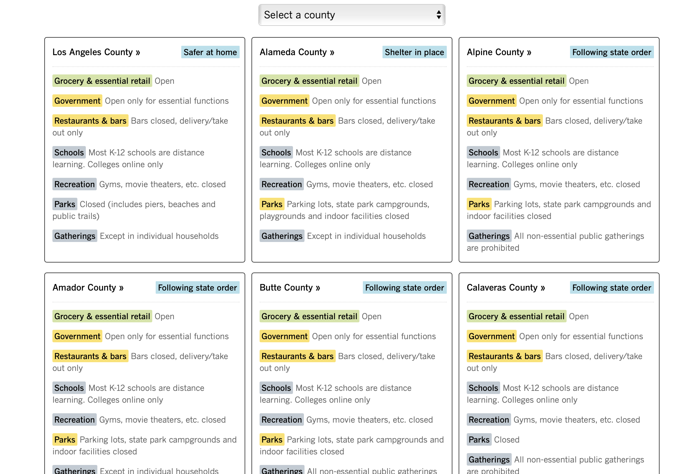

----

## nCov2019.live

https://ncov2019.live/

https://www.bloomberg.com/news/videos/2020-04-05/teen-creates-covid-19-global-tracker-video

### Dashboard: World and USA

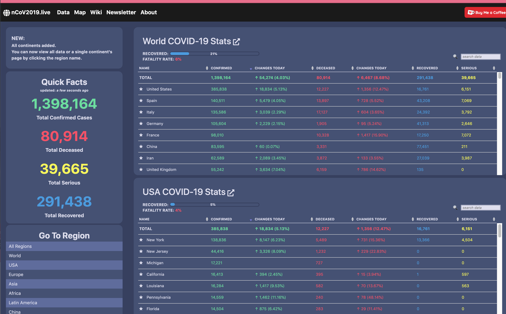

