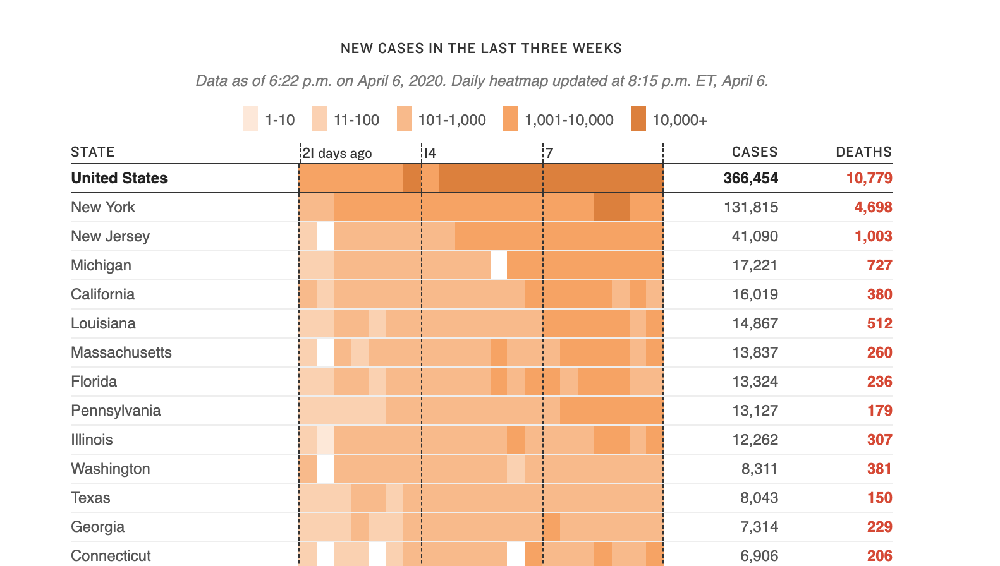
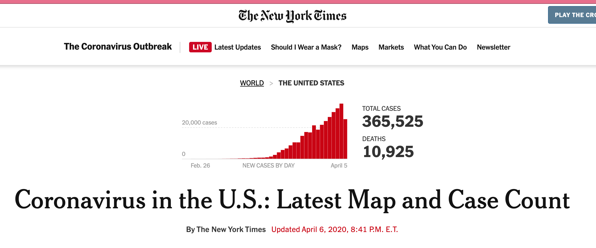
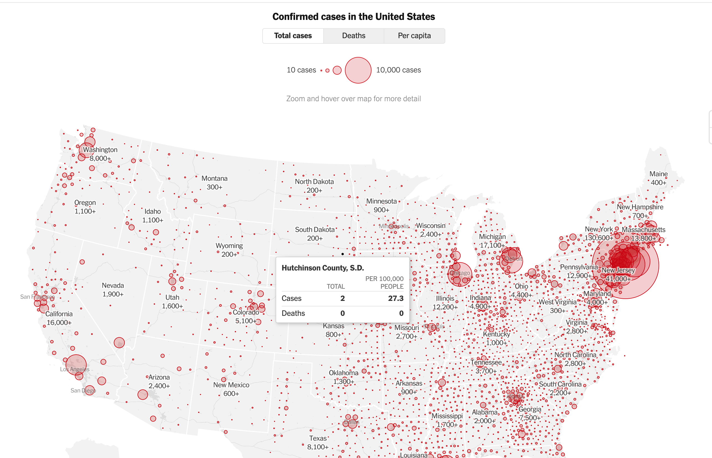
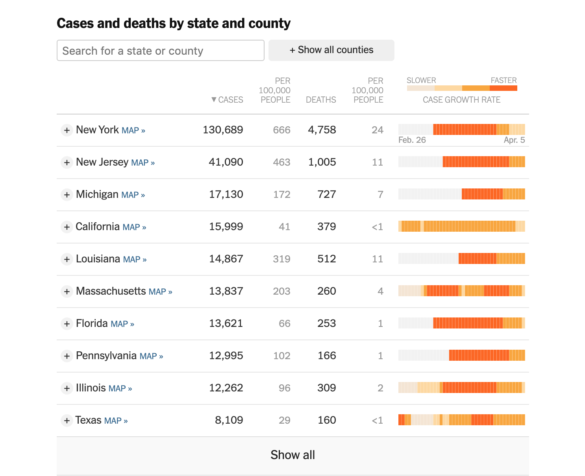
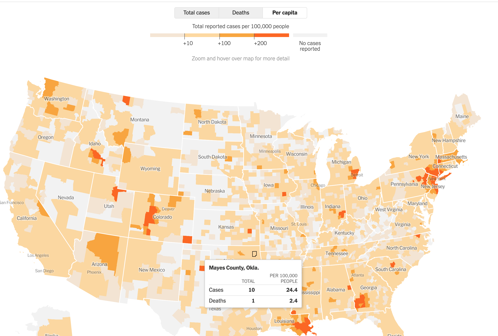
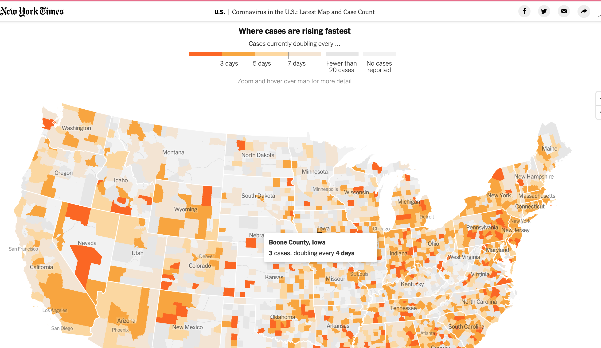
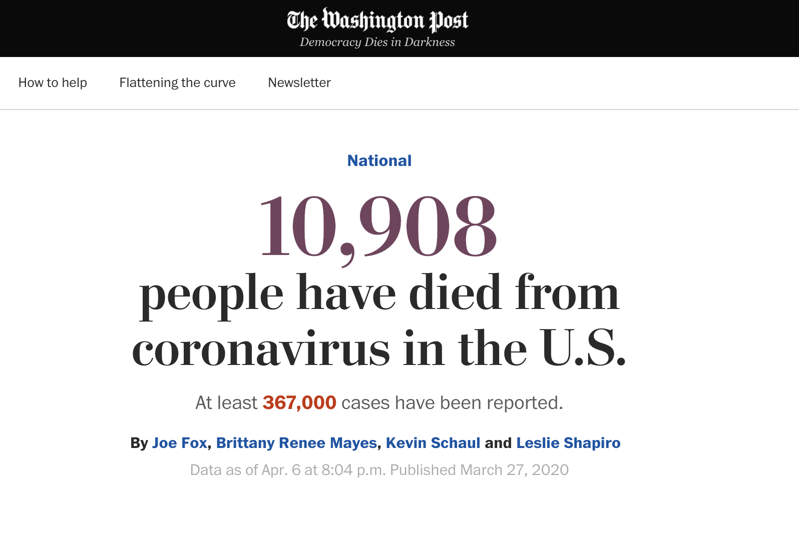
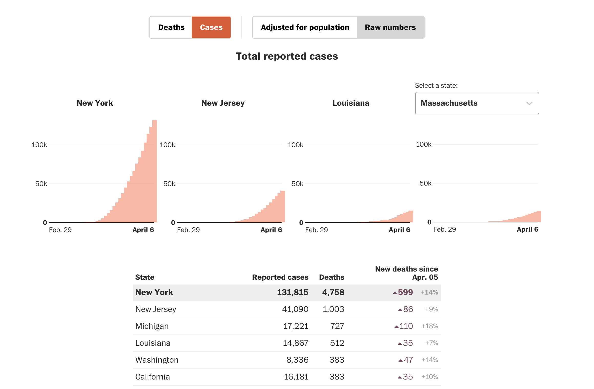
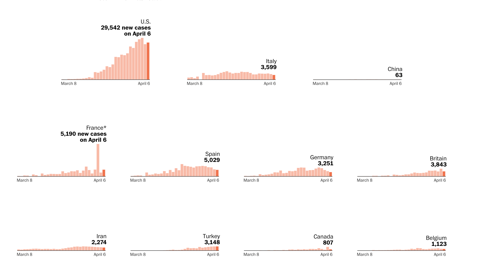

# Other cool trackers

## NPR: state-by-state map and chart

https://www.npr.org/sections/health-shots/2020/03/16/816707182/map-tracking-the-spread-of-the-coronavirus-in-the-u-s

## NYTimes

https://www.nytimes.com/interactive/2020/us/coronavirus-us-cases.html

### Above-fold spark chart

### Total cases map

### Cases table 

### Cases by capita map

### Cases doubling map

-------------

## WaPo

https://www.washingtonpost.com/graphics/2020/national/coronavirus-us-cases-deaths/

### Above fold stat

### Raw cases table and minicharts

### Worldly small multiples

https://www.washingtonpost.com/graphics/2020/world/mapping-spread-new-coronavirus/

